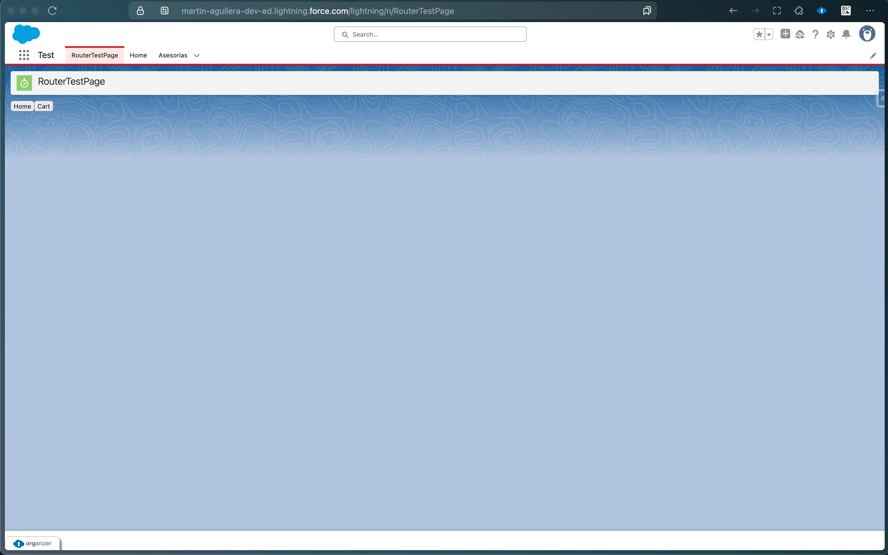
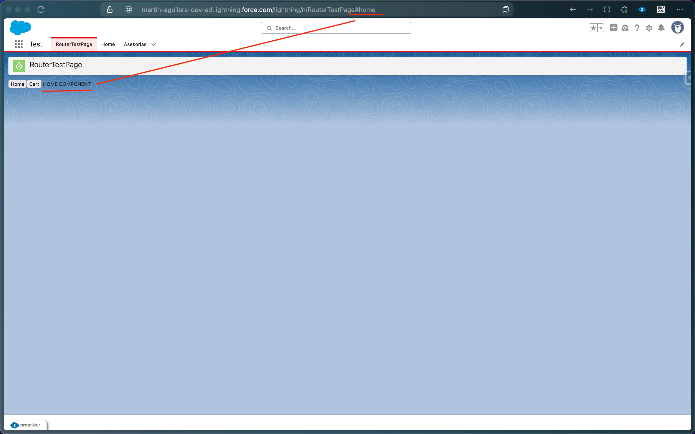
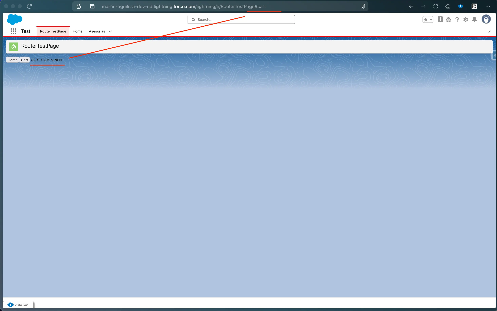
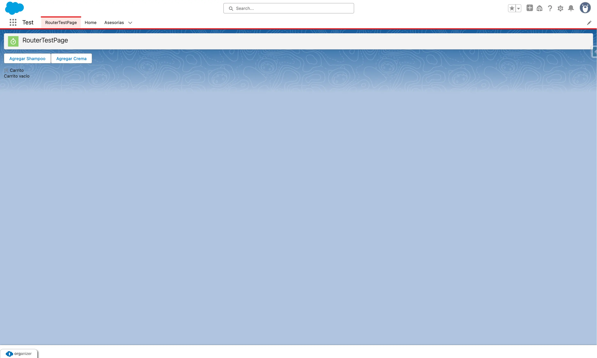
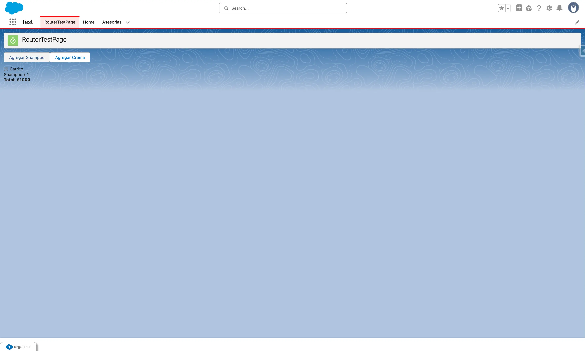
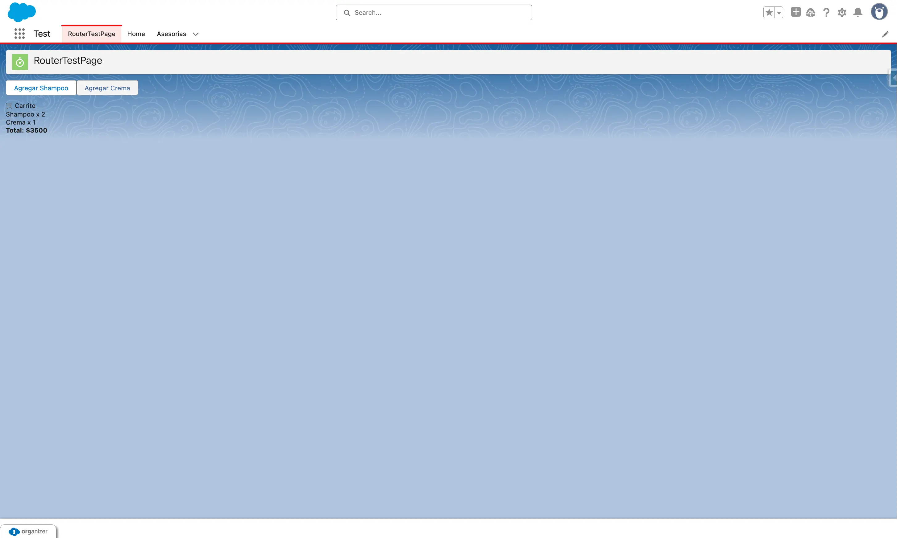

# 🧠 LWC SPA Kit: Global Store + Router + Persistence for Lightning Web Components

Este proyecto tiene como objetivo llevar a LWC (Lightning Web Components) funcionalidades modernas inspiradas en frameworks como React, Vue y Svelte, sin romper con las restricciones de Salesforce.

Incluye:

* 🔁 **Store Global Reactivo**: compartí estado entre componentes sin LMS ni prop-drilling.
* 🌐 **Router SPA**: navegación entre componentes por URL (`#ruta`) al estilo React Router.
* 💾 **Persistencia Extensible**: guardá el estado automáticamente en localStorage, sessionStorage, o Salesforce.

---
### 🖼️ Ejemplos de uso

#### 1. Navegación SPA por rutas




#### 2. Global Store





---

## 🚀 Funcionalidades

### ✅ Store Global (globalStore)

Una clase desacoplada que permite:

* Suscribirse a claves del estado global
* Actualizar valores de forma reactiva
* Escuchar cambios automáticamente desde distintos componentes

Ejemplo de uso:

```js
import { globalStore } from 'c/globalStore';

globalStore.subscribe("user", (user) => {
  console.log("Nuevo usuario:", user);
});

globalStore.set("user", { name: "Tincho" });
```

---

### 🌐 Router SPA (`router.js`)

Permite navegación entre vistas usando el hash de la URL (`#home`, `#cart`, etc.):

* Define rutas con `defineRoute()`
* Navega con `navigateTo()`
* Reacciona automáticamente con `startRouter()`

```js
import { defineRoute, navigateTo, startRouter } from "c/router";

defineRoute("home", () => showHomeComponent());

defineRoute("cart", () => showCartComponent());

startRouter();
navigateTo("home");
```

---

### 💾 Adaptadores de Persistencia

El store acepta adaptadores para guardar el estado en distintos lugares:

* `localStorageAdapter`
* `sessionStorageAdapter`
* `salesforceAdapter` (via Apex)
* `selectiveAdapter()` para guardar solo algunas claves

Ejemplo:

```js
import { localStorageAdapter } from "c/storageAdapter";
export const globalStore = new Store(localStorageAdapter);
```

Ejemplo con Salesforce:

```js
import { salesforceAdapter } from "c/salesforceAdapter";
export const globalStore = new Store(salesforceAdapter);
```

---

## 📦 Estructura del Proyecto

```
force-app/main/default/lwc/
├── globalStore/           # store desacoplado y reactivo
├── storageAdapter/        # adaptadores para persistencia
├── router/                # router SPA
├── cartAdder/             # componente que modifica el store
├── cartViewer/            # componente que reacciona al store
├── routerHost/            # componente principal que muestra vistas
```

---

## 🛠 Requisitos

* Salesforce DX
* Scratch Org o Dev Hub habilitado
* VS Code con extensión Salesforce CLI

---

## 🧪 ¿Cómo probarlo?

1. Deployá los componentes con `SFDX: Deploy Source to Org`
2. Desde el App Builder, agregá `routerHost`, `cartAdder` y `cartViewer`
3. Accedé a la App Page y probá:

   * Navegar entre rutas: `#home`, `#cart`
   * Agregar productos al carrito
   * Ver cómo se actualiza todo sin props ni eventos

---

## ✨ Futuro

* Soporte para Platform Cache, cookies, REST APIs externas
* Modo SSR para Sites
* Módulo para sync entre usuarios

---

## 👨‍💻 Autor

Martin Aguilera - Salesforce Developer

¿Ideas, sugerencias o pull requests? ¡Bienvenidas!
